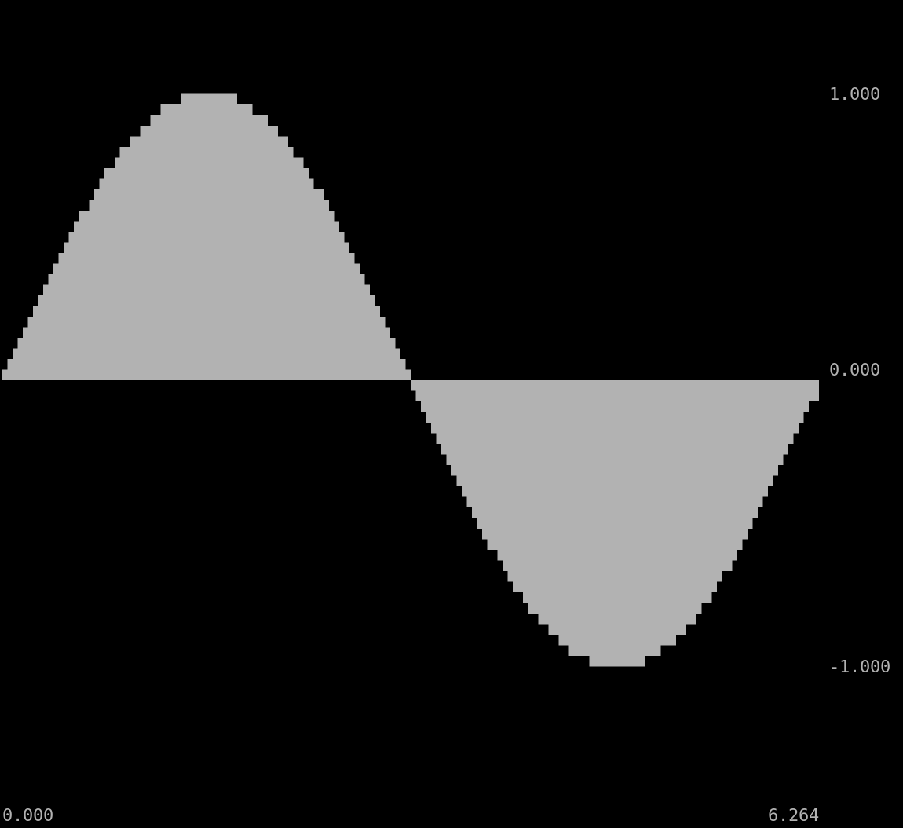

Unicode Plot
============

A very simple function to plot data as Unicode for console output.

The Unicode [block element](https://en.m.wikipedia.org/wiki/Box-drawing_characters#Block_Elements)
symbols allow the graph to have a higher resolution than just one pixel by
character. That is each character has 2x2 pixels. The used symbols are:
`▗` `▝` `▐` `▖` `▄` `▞` `▟` `▘` `▚` `▀` `▜` `▌` `▙` `▛` `█`

Newer Unicode standards have
[symbols for legacy computing](https://en.wikipedia.org/wiki/Symbols_for_Legacy_Computing)
which would even allow 2x3 pixels by character, but the required symbols for
that aren't widely supported yet. Some examples for those symbols are:
`🬀` `🬁` `🬂` `🬃` `🬄` `🬅` `🬆` `🬇` `🬈` `🬉` `🬊` `🬋` `🬌` `🬍` `🬎` `🬏`  
Are they rendered correctly on your system?

Other software uses [braille patterns](https://en.wikipedia.org/wiki/Braille_Patterns#Block)
for this, which gives you even 2x4 pixels by character, but depending on the
used font the empty spots might actually be just empty circles and thus still
fill up the space that is supposed to be empty. Braille example characters:
`⠅` `⠇` `⠍` `⠝` `⠕` `⠏` `⠟` `⠗` `⠎` `⠞`

[Video Demo](https://www.youtube.com/watch?v=Cbuor9gwZxk)

Example
-------

```TypeScript
const TAU = 2 * Math.PI;
const values = new Array(320);
for (let index = 0; index < values.length; ++ index) {
    const x = TAU * (index / values.length);
    values[index] = [x, Math.sin(x)];
}
const lines = unicodePlot(values, {
    yRange: [-1.5, 1.5],
    xLabel: x => x.toFixed(3),
    yLabel: y => y.toFixed(3),
});
console.log(lines.join('\n'));
```


